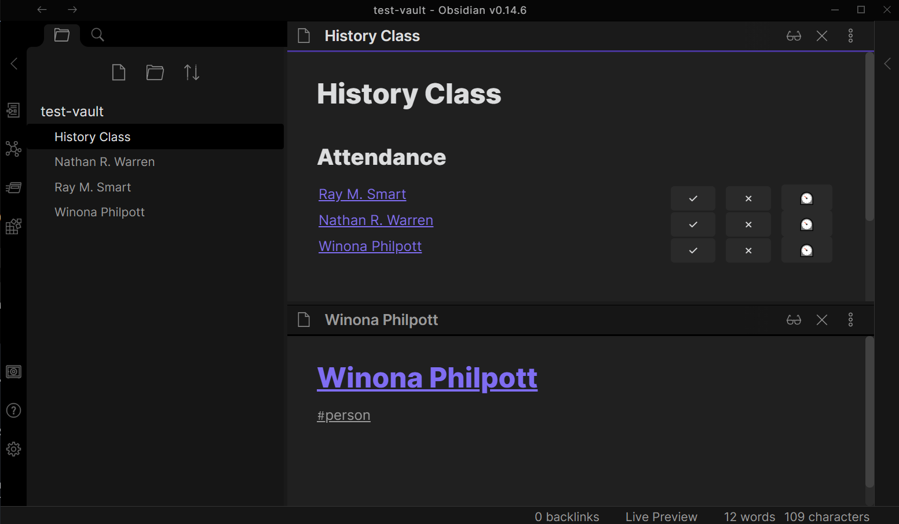
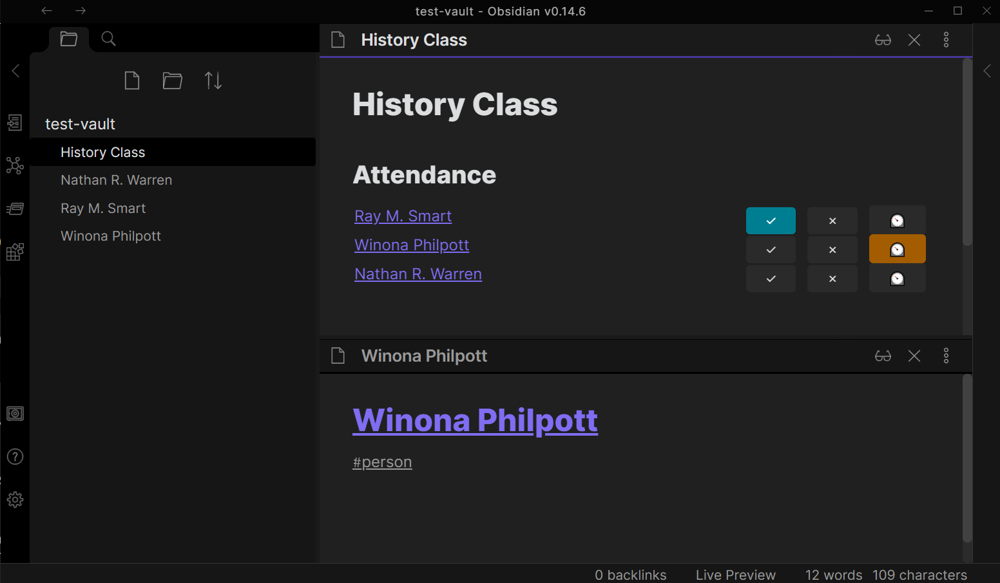

# Obsidian Attendance

This [Obsidian.md](https://obsidian.md/) helps you to keep attendance inside of your notes.

If you like this plugin, consider buying me a coffee.


[](https://www.buymeacoffee.com/Tiim)

**⚠ This plugin is still in early stages of development, expect some bugs and make sure to backup your vault regularly!**

## How to use this plugin

Create a code block with the `attendance` type:

````
```attendance
date: 2022-03-26
title: History Class
query: #person
```
````

The `date`, `title` and `query` fields are all required.



### The date field
*currently unused*

The date field lets you specify the date of the event you want to take attendance for. This field is currently unused, but will be used in the future for exporting attendance lists.

### The title field
*currently unused*

The title field lets you specify the title of the event. This field is currently unused but will be used in the future to allow exporting only certain events. This could for example be set to a specific class name if you are taking attendance for a class.

### The query field

The query field lets you specify what notes are considered possible attendees of the event. The list will include all notes that match the query field. Currently the only query type supported are tag queries.

In the future more query types will be implemented to match the [dataview sources](https://blacksmithgu.github.io/obsidian-dataview/query/sources/).

### Saving the attendance state

When you click on one of the three buttons ("present", "absent", "excused"), the codeblock behind the list will be modified to save the attendance state that you selected. The following shows an example of a codeblock with one present and one excused attendee:

````
```attendance
date: 2022-03-26
title: History Class
query: #person
* [[Ray M. Smart.md]], "present", ""
* [[Winona Philpott.md]], "excused", ""
```
````


### Manually installing the plugin

* Download the `main.js`, `styles.css` and `manifest.json` files from the [latest release](https://github.com/Tiim/obsidian-attendance/releases/latest).
* Create the folder `MyVault/.obsidian/plugins/obsidian-attendance` and put the downloaded files in there.
* Enable the plugin in the community plugins page in the settings.


## Contributing

You are more than welcome to contribute to this plugin! You can contribute by:

* Filing issues for bugs you encountered
* Adding to the documentation
* Adding a feature request
* Making a pull request to the code

### How to work on the code

- Clone this repo into the folder `MyTestVault/.obsidian/obsidian-attendance`
- `npm i` to install dependencies
- `npm run dev` to start compilation in watch mode.

To conveniently reload the plugin every time you make a change, use the [hot-reload plugin](https://github.com/pjeby/hot-reload).

### Improve code quality with eslint

Run `npm run lint` to see all the errors and `npm run lint -- --fix` to fix all errors that are automatically fixable.

### Releasing new releases

- Update minimum obsidian version in `manifest.json`.
- Run `npm version [patch, minor, major]` to update the version.
- Run `git commit && git push && git push --tags`
- Run `gh release create $(cat manifest.json | jq ".version" -r) --generate-notes` to create the github release
- Run `gh release upload $(cat manifest.json | jq ".version" -r) manifest.json styles.css main.js`

### Adding your plugin to the community plugin list

- Check https://github.com/obsidianmd/obsidian-releases/blob/master/plugin-review.md
- Publish an initial version.
- Make sure you have a `README.md` file in the root of your repo.
- Make a pull request at https://github.com/obsidianmd/obsidian-releases to add your plugin.


### API Documentation

See https://github.com/obsidianmd/obsidian-api
